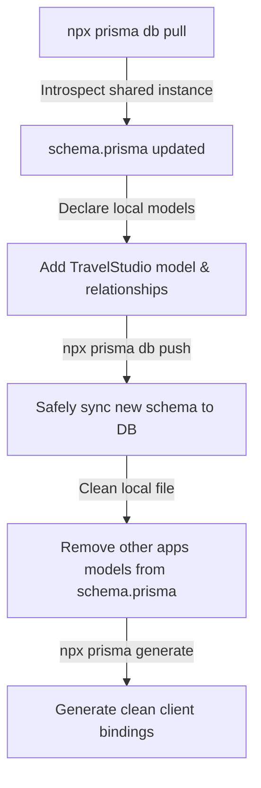

# 🌍 FutureTravel AI Studio — Photorealistic Background Swap SaaS

> **Teleport yourself to gorgeous landmarks and travel destinations worldwide with stunning photorealistic accuracy.** Upload a portrait selfie, pick an iconic scenery preset (Paris, Kyoto, Colosseum, Maldives), and get a photorealistic travel snapshot using Google DeepMind's `nano-banana-2-edit` and `nano-banana-pro-edit` models. A production-ready, self-hostable Next.js SaaS.

**Tech stack:** Next.js 16 (App Router) · Prisma · PostgreSQL · NextAuth (Google OAuth) · Stripe · Tailwind CSS (v4) · MuAPI (nano-banana) · Webhook-backed async delivery  
**Use cases:** Photorealistic travel simulations · Virtual holiday albums · Creative social media portraits · Personalized adventure keepsakes

---

## 🌐 Project Details

**GitHub Repository:** [github.com/jaiprasad04/ai-travel-studio](https://github.com/jaiprasad04/ai-travel-studio)  
**Live Demo:** [ai-travel-studio.vercel.app](https://ai-travel-studio.vercel.app/)

---

## ✨ Core Features

### 🌍 AI Travel Studio (Main Page `/`)
- Upload portrait selfies via drag-and-drop or file selector.
- Fully interactive **guest preview mode** allowing unauthenticated users to explore settings, presets, and sliders, prompting OAuth sign-in only when generation triggers are clicked.
- **Dual AI Scenic Models**:
  - **Standard (nano-banana-2-edit)**: Fast generation with Google concept search tuning.
  - **Pro (nano-banana-pro-edit)**: High-fidelity enhanced predictions with detailed facial structure modeling.
- **6 Gorgeous Landmark Presets** with pre-filled professional travel prompts:
  - 🗼 **Paris (Eiffel Tower)** — Sunset golden hour view in front of the Eiffel Tower.
  - 🌸 **Tokyo (Cherry Blossoms)** — Kyoto/Tokyo streets lined with blooming cherry blossoms.
  - 🏟️ **Rome (Colosseum)** — Sunny morning blogger posture before the historic amphitheater.
  - 🏝️ **Maldives (Sandy Beach)** — Pristine white sands and crystal clear turquoise ocean background.
  - 🐫 **Egypt (Pyramids)** — Adventurous desert dunes alongside the Pyramids of Giza.
  - ❄️ **Swiss Alps (Snow Mountains)** — Cozy winter mountains and snow peaks in Zermatt.
- **Dynamic Variable Pricing based on Model and Resolution**:
  - **Standard Model (v2 Edit)**:
    - **1K Resolution**: **12 credits**
    - **2K Resolution**: **18 credits**
    - **4K Resolution**: **24 credits**
  - **Pro Model (Enhanced)**:
    - **1K & 2K Resolution**: **24 credits**
    - **4K Resolution**: **36 credits**
- Draggable Before/After vertical split comparison slider to reveal portrait travel swaps.

### 🖼️ Personal Creations Gallery (`/gallery`)
- Responsive CSS grid of completed scenic swaps.
- Detail view modal with full Before/After comparison switches.
- Server-side CORS-bypass download proxy (HD download).
- Auto-refresh gallery every 4 seconds to poll processing generations.

### 💳 Stripe Credit Billing (`/pricing`)
- Four one-time credit packs (no subscriptions):
  - **Basic Pack** ($5 / 1,000 credits — ~83 standard runs)
  - **Standard Pack** ($10 / 2,000 credits — ~166 standard runs)
  - **Professional Pack** ($20 / 4,000 credits — ~333 standard runs — Best Value)
  - **Business Pack** ($50 / 10,000 credits — ~833 standard runs)

---

## ⚡ Deployment: Vercel & Production

### Required Environment Variables

| Category | Variable Key | Description |
| :--- | :--- | :--- |
| **Auth** | `NEXTAUTH_SECRET` | NextAuth encryption secret |
| | `NEXTAUTH_URL` | Application root URL (`https://your-app.vercel.app`) |
| | `WEBHOOK_URL` | Upstream webhook domain (`https://your-app.vercel.app`) |
| | `GOOGLE_CLIENT_ID` | Google OAuth Client ID |
| | `GOOGLE_CLIENT_SECRET` | Google OAuth Client Secret |
| **Database** | `DATABASE_URL` | PostgreSQL pool URL (with `?pgbouncer=true`) |
| | `DIRECT_URL` | PostgreSQL direct URL |
| **Stripe** | `STRIPE_SECRET_KEY` | Stripe Secret Key |
| | `NEXT_PUBLIC_STRIPE_PUBLISHABLE_KEY` | Stripe Publishable Key |
| | `STRIPE_WEBHOOK_SECRET` | Webhook signing secret |
| **AI** | `MUAPIAPP_API_KEY` | Get from [muapi.ai](https://muapi.ai) |

### 🚀 Production Deployment Setup

1. **Database**: Spin up a PostgreSQL instance.
2. **Import**: Import the repository into Vercel.
3. **Environment**: Add all required env keys listed above.
4. **Build Script**: Project builds automatically using `prisma generate && next build`.
5. **Database sync**: Run `npx prisma db push` to generate tables.
6. **Callbacks**:
   - Google: `https://ai-travel-studio.vercel.app/api/auth/callback/google`
   - Stripe Webhook: `https://ai-travel-studio.vercel.app/api/stripe/webhook`
   - MuAPI: `https://ai-travel-studio.vercel.app/api/webhook/muapi`

---

## 🛠️ Local Development

### Prerequisites
- Node.js v18+
- PostgreSQL connection string

### Steps

```bash
# 1. Clone the repository
git clone https://github.com/jaiprasad04/ai-travel-studio
cd ai-travel-studio

# 2. Install dependencies
npm install

# 3. Setup local environment
cp .env.example .env
# Edit .env with your Google, Stripe, PostgreSQL and MuAPI keys

# 4. Generate Prisma Client
npx prisma generate

# 5. Spin up development server
npm run dev
```

---

## ⚠️ Database Safety Guidelines

Since all workspace applications share a single Supabase PostgreSQL connection pool, running migrations or schema push actions indiscriminately **WILL drop sibling tables** belonging to other services. 

To prevent this data loss, developers **MUST** adhere to the **Pull-Declare-Push-Cleanup** lifecycle:



1. **Pull First (`db pull`)**: Fetches all 38+ existing tables from the shared DB instance into your local `schema.prisma`.
2. **Declare Local Models**: Write/Declare your application-specific models (e.g. `TravelStudio`) and relationships inside `User`.
3. **Push Changes (`db push`)**: Safely syncs schema to Supabase. Since it contains all existing tables, Prisma adds your table without deleting sibling tables.
4. **Clean Schema File**: Remove the other models from the local `schema.prisma` file so it is compact and easy to read. Keep only `Account`, `Session`, `User`, `VerificationToken`, and `TravelStudio`.
5. **Generate client (`generate`)**: Regenerates type bindings.

---

## 📐 Technical Architecture

```
ai-travel-studio/
├── prisma/
│   └── schema.prisma        # Casing-fixed NextAuth & TravelStudio models
├── public/                  # Static SVG assets
├── src/
│   ├── app/
│   │   ├── api/
│   │   │   ├── auth/        # NextAuth dynamic handler
│   │   │   ├── creations/   # Creations API with self-polling updates
│   │   │   ├── download/    # CORS Bypass attachment proxy downloader
│   │   │   ├── generation/  # dynamic resolution credit deductions
│   │   │   ├── stripe/      # Checkout & Webhook event mapping
│   │   │   └── webhook/     # Async MuAPI completion handler
│   │   ├── gallery/         # CSS Grid travel photos creations gallery
│   │   ├── pricing/         # stripe dynamic resolution cost matrix pricing
│   │   ├── globals.css      # teal/gold gradients & font variables
│   │   ├── layout.js        # loading google Inter font family
│   │   └── page.js          # main AI Travel Studio split-screen workspace
│   ├── components/
│   │   ├── layout/
│   │   │   └── Navbar.jsx   # responsive mobile hamburger navigation
│   │   └── Providers.jsx    # Session provider packaging NextAuth
│   └── lib/
│       ├── auth.js          # Google NextAuth configurations
│       ├── config.js        # variable pricing & credits variables
│       ├── prisma.js        # dynamic db client connector
│       ├── stripe.js        # stripe initialization handler
│       └── services/
│           ├── billing.js   # stripe payment session checkout helper
│           └── user.js      # credit deductions & add services
├── package.json             # pre-build prisma generate script
└── prisma.config.ts         # dynamic Supabase pool adapter configurations
```
